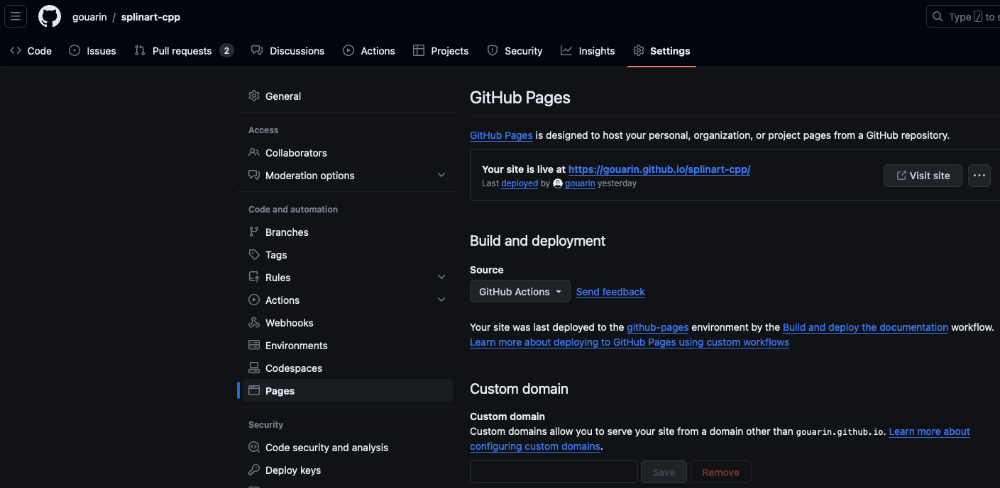

# Documentation

:::{hint}Objectifs de cette partie
- Mise en place de la documentation
- Utilisation de Sphinx couplé à Doxygen et Breathe
- Disponibilité de celle-ci sur GitHub Pages
:::

:::{note}Notions GitHub Actions abordées
- Construction d'artifact
- Connexion avec GitHub Pages
- Jouer sur les événements de déclenchement
- Condition sur l'exécution des travaux
:::

Nous allons à présent générer la documentation de notre logiciel et la rendre disponible via [GitHub Pages](https://pages.github.com/). Nous utiliserons [Sphinx](https://www.sphinx-doc.org), [breathe](https://breathe.readthedocs.io) et [doxygen](https://www.doxygen.nl/) pour générer la documentation en html. La configuration comporte un certain nombre d'étapes et nous ne souhaitons pas perdre de temps sur ce point. Nous avons néanmoins mis une partie [Mise en place de la documentation](#config-sphinx) à la fin de ce chapitre qui décrit les étapes si vous voulez le refaire plus tard.

:::{note}
N'oubliez pas de retourner dans la branche `main` et de faire

```bash
git pull
```
:::

Nous avons donc mis dans le répertoire `4.documentation/required_files` un répertoire `doc` qui contient la configuration et les fichiers markdown constituant la documentation. Il vous suffit de le copier dans votre répertoire.

Créez une nouvelle branche.

## Test local

Nous allons essayer de générer la documentation en local pour s'assurer que tout se passe correctement. Pour cela, nous avons ajouté une tâche dans le fichier `pixi.toml` qui fait la chose suivante

```toml
doc = { cmd = "cd doc; make html" }
```

Exécutez cette tâche et vérifiez que tout se passe bien.

:::{tip} html
Vous devriez avoir un dossier `html` qui s'est créé. Il vous suffit d'ouvrir dans votre navigateur le fichier `index.html`.
:::

## Mise en place de l'action

Nous allons ajouter une action pour la documentation dans le dossier `.github/workflows` que nous appelons `doc.yml` qui se déclenchera au moment d'une pull request.

Écrivez l'action en vous appuyant sur ce que vous avez fait précédemment. Pour le moment, nous souhaitons juste faire ce que nous avons fait en local et mettre le répertoire `html` dans une archive : voir l'action [upload-pages-artifact](https://github.com/actions/upload-pages-artifact).

:::{tip} Artifact
A la fin de cette étape, vous devriez avoir accès à une archive en allant dans les actions de votre dépôt. Si vous téléchargez cette archive et que vous regardez ce qu'il y a dedans, vous devriez retrouver le contenu du répertoire `html`.
:::

## Configuration de GitHub Pages

Vous devez configurer GitHub Pages en allant dans les `Settings` de votre dépôt puis dans `Pages` et sélectionner pour les `Source` `GitHub Actions` comme sur cette image



Vous devez également ajouter dans votre fichier `doc.yml`, les lignes suivantes

```yaml
# Allow one concurrent deployment
concurrency:
  group: "pages"
  cancel-in-progress: true
```

Ceci afin d'éviter que plusieurs actions essaient de générer le site en même temps.

:::{note} Pour plus d'information
[Using concurrency](https://docs.github.com/en/actions/using-jobs/using-concurrency)
:::

Vous pouvez à présent utiliser l'artifact créé précédemment pour GitHub Pages en ajoutant le travail suivant

```yaml
    deploy:
      runs-on: ubuntu-latest
      needs: build
      permissions:
        contents: read
        pages: write
        id-token: write
      steps:
        - name: Deploy to GitHub Pages
          id: deployment
          uses: actions/deploy-pages@v2
```

:::{note}Plusieurs remarques sur cette étape

- Il n'est pas nécessaire de la faire si la construction de la documentation échoue : `needs: build`. Il faut le modifier en fonction du nom que vous avez mis pour le travail précédent.
- Pour déployer le site sur GitHub Pages, il faut des permissions et notamment le droit d'écriture :
    ```yaml
    permissions:
      contents: read
      pages: write
      id-token: write
    ```
:::

À la fin du processus, vous devriez être en mesure de voir la documentation à l'adresse suivante `https://votre_login.github.io/nom_projet` ou `https://votre_organisation.github.io/nom_projet`.

:::{attention}
Il y a plusieurs choses qui ne vont pas dans ce que nous venons de faire.
1. Est-ce que nous souhaitons que ce processus se déclenche uniquement au moment de la pull request ?
2. Est-ce que nous voulons que cette action soit réalisée également sur les fork ?
3. Est-ce que nous voulons que le GitHub Pages soit sur l'ensemble des branches ou seulement sur la branche principale ?
4. Est-ce que le processus `ci.yml` doit se déclencher à chaque fois que nous modifions la documentation ?
:::

Nous allons détailler chacun de ces points et voir comment faire avec GitHub Actions pour avoir un meilleur contrôle.

## Définir quand déclencher le workfow

Nous allons répondre ici aux points 1 et 4 où nous souhaitons avoir un déclenchement un peu plus fin. En effet, nous souhaitons que le workflow soit déclenché que si la pull request porte sur la branche principale. Nous aimerions par ailleurs que le workflow se déclenche au moment d'un `push` dans cette même branche principal. Enfin, nous aimerions pouvoir déclencher manuellement.

Tout se passe dans la partie qui se trouve au début du fichier `yaml` dans la section `on`. Jusqu'à présent, nous avons fait quelque chose de très simple en ne choisissant que `pull_request`. Mais, nous pouvons déclencher le workflow pour plein de types d'événements GitHub: [Events that trigger workflows](https://docs.github.com/actions/using-workflows/events-that-trigger-workflows).

Nous pouvons spécifier, lorsque nous sommes dans le cas d'une pull request, la branche cible sur laquelle porte la pull request pour déclencher le workflow. Voici un exemple

```yaml
on:
  pull_request:
    branches:
      main
```

Ainsi, si vous faites une pull request sur une branche `dev`, ce workflow ne sera jamais exécuté.

Vous avez également l'événement `push` qui vous permet de déclencher le workflow si vous poussez les modifications dans une branche (comme par exemple lors d'une fusion d'une pull request dans une branche). Si vous ne spécifiez pas le nom de la ou les branches, le workflow sera exécuté à chaque fois. Mais comme pour le mot clé `pull_request`, vous pouvez spécifier la ou les branches. Voici un exemple

```yaml
on:
  push:
    branches:
      main
```

Enfin, nous voulons pouvoir déclencher manuellement : cela se fait via l'événement `workflow_dispatch`.

Modifiez le workflow pour prendre en compte ce déclenchement plus fin pour la génération de la documentation.

Concernant le point 4, si nous ne faisons qu'écrire de la documentation dans le répertoire `doc`, il n'est peut-être pas nécessaire d'exécuter le worflow défini dans `ci.yml` car le code n'aura pas changé. Toujours dans la partie gérant les événements, il est possible d'indiquer des chemins indiquant que le workflow ne se déclenchera que si les changements ont été effectués dans ceux-ci. Voici un exemple

```yaml
on:
  pull_request:
    paths:
      - 'doc/**'
      - '.github/workflows/doc.yml'
```

Ici, le worflow sera exécuté que si le répertoire `doc` ou le workflow sont modifiés.

Nous pouvons également exclure des chemins comme dans l'exemple suivant

```yaml
on:
  pull_request:
    paths-ignore:
      - 'doc/**'
```

Modifiez le workflow `ci.yml` pour qu'il ne se déclenche pas si le répertoire `doc` est modifié. Testez.

## Définir quand déclencher les travaux

Nous allons à présent répondre aux points 2 et 3. Si nous déclenchons la génération de la documentation sur les forks, nous allons avoir la mauvaise surprise d'avoir des documentations du projet éparpillées un peu partout. Rappelons qu'à la fin du processus, vous aurez une documentation à l'adresse `https://votre_login.github.io/nom_projet` ou `https://votre_organisation.github.io/nom_projet`. Quelle est la documentation de référence ? Impossible de le savoir pour une personne qui est en dehors du projet. Nous voudrions donc spécifier le nom du répertoire GitHub qui est autorisé à déclencher le travail pour la création de l'artifact et que cet artifact ne soit utilisé par GitHub Pages que si la branche est la branche principale.

Nous allons utiliser une condition [if](https://docs.github.com/en/actions/using-jobs/using-conditions-to-control-job-execution) pour déclencher le travail sous certaines conditions.

Voici un exemple qui déclenche le travail que si nous sommes dans un répertoire GitHub spécifique

```yaml
jobs:
    my_job:
      if: github.repository == 'gouarin/splinart-cpp'
```

Voici un exemple qui déclenche le travail que si nous sommes dans un répertoire GitHub spécifique et sur la branche principale

```yaml
jobs:
    my_job:
      if: github.repository == 'gouarin/splinart-cpp' && github.ref == 'refs/heads/main'
```

Modifiez le worklfow `doc.yml` pour que
- la compilation de la documentation ne se fasse que si vous êtes dans votre dépôt et non dans un fork,
- la mise en place de GitHub Pages à partir de l'artifact ne se fasse que si vous êtes dans votre dépôt et non dans un fork et que vous êtes sur la branche principale.

Vérifiez que tout fonctionne bien, puis faites un `Squash and merge`.

(config-sphinx)=
## Mise en place de la documentation

Nous expliquons ici comment initialiser le répertoire documentation en utilisant les outils cités au début de ce chapitre : Sphinx, Breathe et Doxygen. Les deux derniers sont utilisés pour pouvoir mettre la documentation C++ des fonctions, classes... dans Sphinx.

Il nous faut d'abord créer l'architecture du répertoire Sphinx en utilisant la ligne de commande

```bash
sphinx-quickstart doc
```

Vous allez devoir répondre à un certain nombre de questions. Toutes vos réponses se trouveront dans un fichier `conf.py`. Vous pourrez donc revenir sur vos choix à tout moment.

Nous allons à présent configurer Doxygen. Vous devez aller dans le répertoire `doc` et créer un fichier de configuration `doxyfile` reconnue par celui-ci. Il suffit d'exécuter la ligne de commande

```bash
doxygen -g doxyfile
```

Il nous reste à modifier quelques entrées de ce fichier de la manière suivante

```txt
PROJECT_NAME = "splinart"
XML_OUTPUT = xml
INPUT = ../include
GENERATE_LATEX = NO
GENERATE_MAN = NO
GENERATE_RTF = NO
CASE_SENSE_NAMES = NO
GENERATE_HTML = NO
GENERATE_XML = YES
RECURSIVE = YES
QUIET = YES
JAVADOC_AUTOBRIEF = YES
WARN_IF_UNDOCUMENTED = NO
MACRO_EXPANSION = YES
PREDEFINED = IN_DOXYGEN
```

À partir de cette étape, si vous exécutez la ligne de commande

```bash
doxygen
```

vous devriez générer la documentation au format XML utilisé par Breathe.

Nous allons à présent ajouter les extensions nécessaires dans la configuration de Sphinx. À savoir

```python
extensions = ['breathe', 'myst_parser']
breathe_projects = { 'splinart': '../xml' }
```

:::{note}
Nous avons aussi ajouté l'extension [myst-parser](https://myst-parser.readthedocs.io) qui permet d'avoir un langage markdown enrichi. Si vous voulez des extensions particulières, il faut les ajouter dans la configuration de Sphinx. Nous avons ajouté la liste suivante

```python
myst_enable_extensions = [
    "amsmath",
    "attrs_inline",
    "colon_fence",
    "deflist",
    "dollarmath",
    "fieldlist",
    "html_admonition",
    "html_image",
    "replacements",
    "smartquotes",
    "strikethrough",
    "substitution",
    "tasklist",
]
```
:::

Nous allons maintenant changer le thème par défaut en mettant [pydata-sphinx-theme](https://pydata-sphinx-theme.readthedocs.io) dnas le fichier de configuration

```python
html_theme = 'pydata_sphinx_theme'
```

Enfin, il faut modifier le fichier `Makefile` qui se trouve dans le répertoire `doc` pour que Doxygen soit déclenché à chaque fois que vous lancez la génération de la documentation. Voici le `Makefile` complet

```makefile
# Minimal makefile for Sphinx documentation
#

# You can set these variables from the command line, and also
# from the environment for the first two.
SPHINXOPTS    ?=
SPHINXBUILD   ?= sphinx-build
SOURCEDIR     = source
BUILDDIR      = build

# Put it first so that "make" without argument is like "make help".
help:
    @$(SPHINXBUILD) -M help "$(SOURCEDIR)" "$(BUILDDIR)" $(SPHINXOPTS) $(O)

.PHONY: help Makefile

# Catch-all target: route all unknown targets to Sphinx using the new
# "make mode" option.  $(O) is meant as a shortcut for $(SPHINXOPTS).
%: Makefile
    doxygen
    @$(SPHINXBUILD) -M $@ "$(SOURCEDIR)" "$(BUILDDIR)" $(SPHINXOPTS) $(O)
```

:::{attention}
Si vous êtes sous Windows, c'est le fichier `make.bat` qu'il faut modifier.
:::

Il ne vous reste plus qu'à écrire la documentation. Nous vous laissons regarder dans le répertoire `material/4.documentation/required_files/doc/source` pour voir un exemple. Das le répertoire `api`, vous verrez l'utilisation de Breathe.
