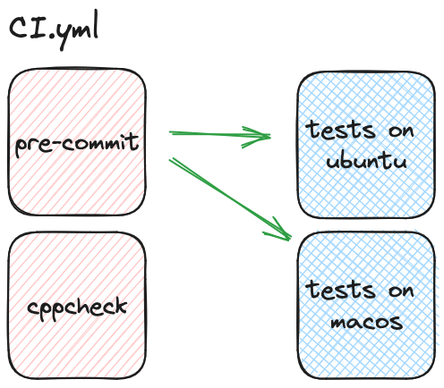

# pre-commit, formatage et linter

:::{hint}Objectifs de cette partie
- Utilisation de pre-commit
- Mise en place d'analyse statique et formatage
:::

:::{note}Notions GitHub Actions abordées
- Définir plusieurs travaux
- Mettre des dépendances entre ces travaux
:::

Vous avez réussi à faire tourner les tests de votre application sur linux et macos en vous appuyant sur pixi. C'est chouette !! Il est temps de passer au packaging.

Mais, avez-vous eu la curiosité de regarder le code ? C'est une catastrophe : rien est indenté pareil, les noms des fonctions ne suivent aucune nomenclature. Si nous laissons les choses en l'état, tout le monde va y aller de sa petite touche et vous n'aurez plus jamais envie d'aller y jeter un œil. Heureusement, il y a quelques commentaires.

Voyons voir si pre-commit peut nous aider.

## pre-commit

Nous décidons donc de mettre en place pre-commit pour que le code soit formaté toujours de la même manière. pre-commit est déjà installé dans l'environnement de pixi et, de ce fait, vous ne devriez pas être obligé de l'installer.

:::{attention}
Vous devez être dans le shell de l'environnement pixi pour avoir la commande pre-commit

```bash
pixi shell
```
:::

:::{note}
N'oubliez pas de retourner dans la branche `main` et de faire

```bash
git pull
```

pour récupérer les derniers changements.
:::

Nous allons créer à présent une nouvelle branche `add-pre-commit` dans laquelle nous allons ajouter le fichier `.pre-commit-config.yaml` comme indiqué [ici](#pre_commit_target).

Il vous faut également ajouter le fichier `.clang-format` qui définit les règles de formatage qui se trouve dans le répertoire `material/3.pre-commit/required_files`.

Exécutez l'initialisation des **hooks** à l'aide de la ligne de commande

```bash
pre-commit install
```

Exécutez maintenant les vérifications sur l'ensemble des répertoires et regardez les résultats

```bash
pre-commit run --all-files
```

Vous pouvez pousser les changements. Nous souhaitons à présent que cette erreur ne se reproduise pas. Pour cela, ajoutez un travail dans le fichier `ci.yml` qui met en place le pre-commit et qui vérifie que ce qui est modifié vérifie bien les règles établies.

:::{tip} Conseil
Regardez dans le MarketPlace et il ne sera pas nécessaire pour ce travail de l'exécuter sur plein d'OS : un seul suffit.
:::

Vous devriez avoir maintenant au niveau de GitHub Actions, le processus suivant


Mais est-ce vraiment ça que nous souhaitons ? Est-ce que nous ne préférerions pas que les tests ne soient exécutés que si le code est bien formaté ? Si oui, alors nous aimerions plutôt le processus suivant

:::{figure} ./figures/ci-yml-2.png
:name: needs-fig
:::

Heureusement, GitHub Actions  permet de dire qu'un travail a besoin que d'autres soient terminés correctement pour être enclenché. En voici la syntaxe

```yaml
jobs:
  pre-commit:
    ...

  tests:
    needs: pre-commit
    ...
```

:::{note}
Vous pouvez demander que le travail soit effectué même en cas d'échec en [ajoutant une condition](https://docs.github.com/actions/using-workflows/workflow-syntax-for-github-actions#exemple--non-exigence-de-r%C3%A9ussite-de-travaux-d%C3%A9pendants). Mais nous ne le ferons pas ici.
:::

Modifiez votre processus pour qu'il ressemble à celui de la [](#needs-fig).

## cppcheck

En plus du pre-commit, nous aimerions ajouter une analyse statique de notre code avant de pouvoir exécuter les tests du logiciel `splinart-cpp`. Nous aurions pu mettre `clang-tidy`, mais la vérification peut prendre du temps surtout si la base de code est grande. Nous le garderons donc pour plus tard où nous ferons des tests de nuit.

`cppcheck` est plus limité que `clang-tidy` mais il permet déjà d'enlever un certain nombre de problèmes. Pour qu'il fonctionne, il doit avoir les commandes de compilation que va effectuer CMake. Nous pouvons les obtenir en effectuant la commande suivante

```bash
cmake -S . -B .build -DCMAKE_EXPORT_COMPILE_COMMANDS=ON -DCMAKE_BUILD_TYPE=Debug -DBUILD_EXAMPLES=ON
```

Cette commande va créer un fichier `.build/compile_command.json`. Il nous suffit à présent de lancer `cppcheck` via la commande

```bash
cppcheck --enable=missingInclude,unusedFunction,warning,style,portability,performance -q --project=.build/compile_commands.json --suppressions-list=.cppcheck 2> cppcheck_err.txt
```

:::{note}
Le fichier `.cppcheck` est dans le répertoire `material/3.pre-commit/required_files`.
:::

:::{important}
Si jamais, par inadvertance, une dépendance venait à manquer, n'hésitez pas à la rajouter en utilisant la commande `pixi add`.
:::

Écrivez une étape qui exécute ces deux commandes en même temps. Nous lui donnerons le nom de `Configure`.

:::{tip} Vous aurez besoin de
- [Définir le nom](https://docs.github.com/actions/using-workflows/workflow-syntax-for-github-actions#jobsjob_idname)
- [Définir `run` sur plusieurs lignes](https://docs.github.com/fr/actions/using-workflows/workflow-syntax-for-github-actions#jobsjob_idstepsrun)
- [Activer le shell pixi](https://github.com/marketplace/actions/setup-pixi#custom-shell-wrapper)
:::

Si cette commande écrit dans le fichier `cppcheck_err.txt` alors il y a une erreur. Nous devons donc le vérifier. Ajoutez une étape qui fait la chose suivante

```bash
if [[ -s cppcheck_err.txt ]];
then
    cat cppcheck_err.txt
    exit 1
fi
```

Vérifiez que tout fonctionne bien en ayant à présent le schéma suivant



Faites un `Squash and merge`.
